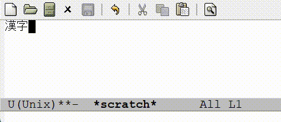
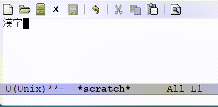

# FAQ よくある質問

## Q. Sumibiの特徴は？

A. モードレスの日本語変換システムです。

WindowsやmacOSの標準の日本語入力システムは、日本語入力モードのオンとオフを切り替える必要がありますが、
Sumibiはどのような場面であっても、Ctrl-Jキーを押すと直前のローマ字の文章を日本語に変換します。

## Q. どのOSで利用できますか？

A. Windows/Linux/macOSのどれでも動作します。

## Q. 対応しているEmacsバージョンは？

A. Emacs 28.x 以上に対応しています。

## Q. Emacsの他に必要なソフトウェアはありますか？

A. いいえ、必要ありません。

## Q. OpenAIのアカウントは必要ですか？

A. はい、必要です。OpenAI APIの契約をして、APIキーを取得してください。

## Q. Sumibiを使うとOpen AIの費用はどれくらいかかりますか？

A. gpt-3.5-turboを使った場合、1ドキュメントを書くのに約1円から5円程度です。
Sumibiの設定をGPT-4に変更した場合は、大体10倍の費用がかかります。

## Q. 期待した漢字が出ません。うまく変換するやり方はありますか？

A. なるべく長い文書を入力してから変換するのがコツです。

また、思った漢字が出なかった場合は、間違った漢字の部分を範囲選択した上でCtrl-J気を押すと、
同音異議語が複数出力されます。

## Q. 漢字ではなくひらがなやカタカナで書きたい単語があります。どうすれば良いですか？

単語を範囲選択した上でCtrl-Jキーを押すと、ひらがなとカタカナが出力されます。

## Q. 変換精度を上げる方法はありますか？

gpt-3.5-turboはまだまだ思ったような漢字が出せませんが、gpt-4に切り替えるとかなり変換精度が上がります。
gpt-3.5-turboしか使えない場合は、なるべく長い文章を作って変換してください。

## Q. GPTを使っているなら、英語から日本語への翻訳もできそうです。どのようにしたら翻訳できますか？

A. ローマ字の文章の代わりに、英語の文章の最後でCtrl-Jを入力すると日本語の文章へ変換できます。

## Q. GPTを使っているなら、長文の要約もできそうです。どのようにすれば要約ができますか？

A. Sumibi Ver 1.3 では、まだ長文の要約をサポートしていません。将来バージョンでサポート予定です。

## Q. OpenAIからの応答が遅い場合があります。タイムアウトを短くすることはできますか？

A. はい、カスタマイズ変数 sumibi-api-timeout を60秒から変更してください。

## Q. gpt-3.5-turbo 以外のモデルを利用したいのですが、どのようにすれば良いですか？

A. カスタマイズ変数 sumibi-current-model を "gpt-4" などに変更してください。
