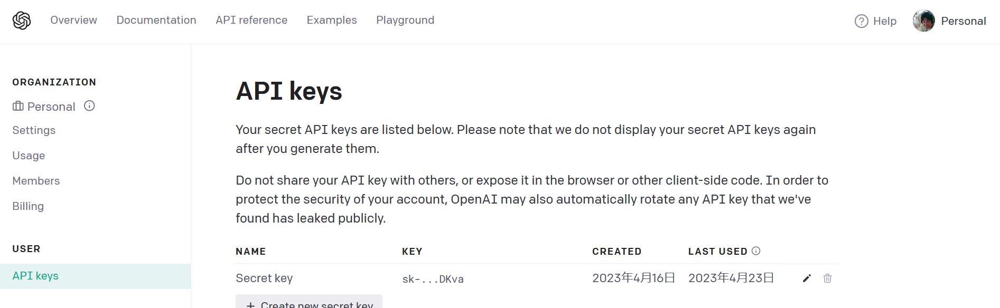
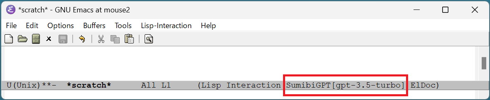
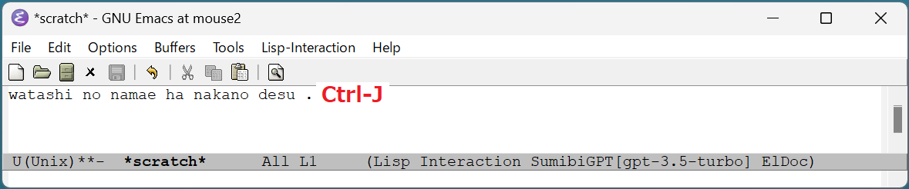
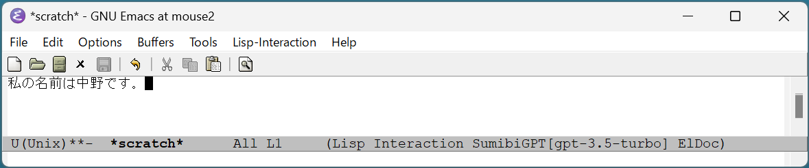
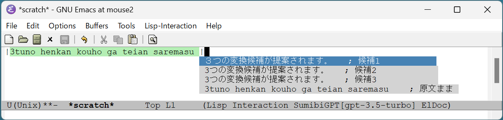
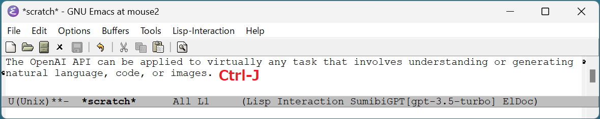
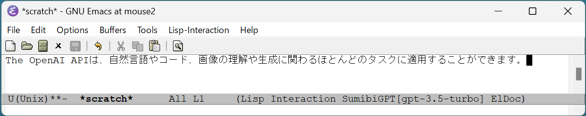
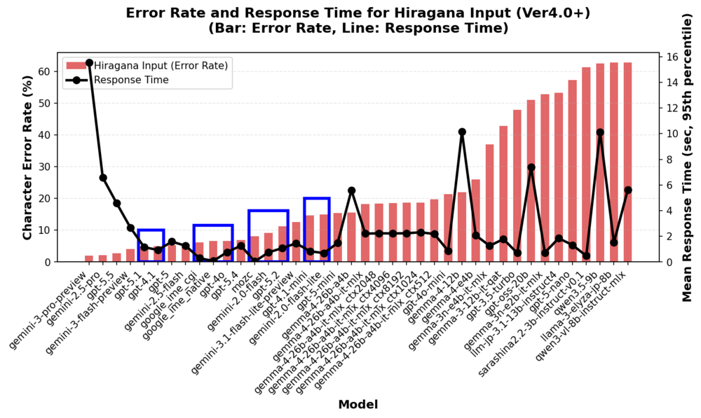
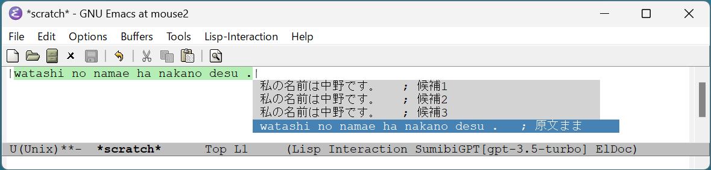

# Sumibi

Japanese/Chinese input method powered by ChatGPT API

[English](README.en.md) | [中文](README.zh.md)


## Sumibiとは

Emacs用の日本語入力システム(IME)です。

Sumibiはモードレスです。
日本語入力モードに切り替えることなく日本語を入力できます。

日本語と英語の相互翻訳もサポートしていますので、英語で文章を書くことが多い人にもおすすめです。

よくある質問はこちら。[FAQ](FAQ.md)

Sumibiが利用している各種LLMのベンチマーク結果はこちら。[benchmarkのREADME](benchmark/README.md)

## 利用可能なEmacsバージョン

Emacs version 29.x 以上 (Windows/Linux/macOS) で動作します。Emacs以外の追加ソフトウェアは不要です。

## Emacsクライアントのインストール

1. OpenAI AIのサブスクリプションを契約します。

[https://platform.openai.com/account/api-keys](https://platform.openai.com/account/api-keys)


2. 環境変数 `OPENAI_API_KEY` にOpenAI APIキーを登録します。（`SUMIBI_AI_API_KEY` も使用可能です）
3. MELPAからパッケージ「sumibi」をインストールします。
4. \~/.emacs.d/init.el に以下のコードを追加します。

```lisp
(require 'sumibi)
(global-sumibi-mode 1)
```

Gemini APIを使う場合は、環境変数 `GEMINI_API_KEY` を設定し、init.el に以下を追加するだけです。

```lisp
(require 'sumibi)
(setq sumibi-provider 'gemini)
(global-sumibi-mode 1)
```

`sumibi-provider` を設定すると、ベースURLやデフォルトモデルが自動的にプロバイダーに合わせて切り替わります。環境変数 `SUMIBI_AI_BASEURL` や `SUMIBI_AI_MODEL` による手動指定も引き続き利用可能で、設定されている場合はそちらが優先されます。

## インストールが成功したかどうかの確認方法

Emacsを再起動するとSumibiがステータスバーに表示されます。
[gpt-5] はOpenAI API呼び出しで使用しているGPTのモデルです。


## ローマ字や英語の文章から日本語への変換

https://github.com/user-attachments/assets/0e66d428-a35e-4920-a816-2bb0c6cc99c9

1. ローマ字で書いた文章の最後にカーソルを合わせて、Ctrl-J を入力すると日本語の文章に置き換わります。
    
    
2. 変換結果が気に入らない場合は、そのまま Ctrl-J を入力すると変換候補のポップアップが表示されるので、その中から選択できます。
    
3. 英語の文章の最後にカーソルを合わせて、Ctrl-J を入力すると、日本語の文章に変換されます。
    
    

## 日本語から英語への翻訳

日本語の文章をregion選択した状態で、ESC 、 j を順に入力すると選択範囲が英語に翻訳されます。

「ESC 、j」は、代わりに ALT+j でも入力可能です。

## GPTの利用モデルの切り替え

M-x sumibi-switch-modelでポップアップから利用モデルを動的に変更することができます。

https://github.com/user-attachments/assets/7fae1c5b-84ed-402c-9b5e-9bfb39f29237

`sumibi-provider` の設定に応じて、プロバイダーに対応するモデルが自動的に候補に表示されます。

### Sumibiに合ったモデルは？

Sumibiを快適に使うためには、応答速度と変換精度の両方を満たすモデルが必要です。
以下の青枠の中がスイートスポットですが、その中でもランニングコストなども考慮して、gpt-5.1とgemini-2.0-flashが最も適しているといえます。(2025年11月時点)

**注記**: gemini-3-flash-previewは非常に高精度（エラー率3.1%）ですが、応答時間が11秒程度と長く、IMEの実用基準（2秒以内）を満たしていません。これはpreview版であるためと考えられ、stable版がリリースされた際には応答速度が改善される可能性があります。stable版がリリースされた際には再度ベンチマークを実施する予定です。




## アンビエント変換の利用

Sumibiの通常の変換はCtrl+Jで実行しますが、アンビエント変換は助詞や句読点の入力をトリガーに、意識することなく自然に日本語変換が行われる機能です。

新機能のアンビエント変換についてはこちら。[AMBIENT](AMBIENT.md)

## Undo

変換結果が気に入らない時は、ESC-u キーを入力することでUndoできます。

または、変換結果に原文ままの選択肢がありますので「原文まま」を選択します。


## 利用するAIサービスの切り替え

AIサービスはOpenAI以外にも切り替えられます。GeminiやDeepSeekの場合は `sumibi-provider` を設定するだけで、ベースURLやモデル名が自動設定されます。その他のOpenAI互換サービスは環境変数で切り替えることができます。

- 向き先をGeminiに切り替える場合（推奨）

    ```lisp
    ;; 環境変数 GEMINI_API_KEY を設定
    (setq sumibi-provider 'gemini)
    ```

    環境変数による従来の方法も引き続き利用可能です：

    ```
    (setenv "SUMIBI_AI_API_KEY" "AIxxxxxxxxxxxxxxxxxxxxxxxxxxxx") ;; Gemini APIのAPIキー
    (setenv "SUMIBI_AI_BASEURL" "https://generativelanguage.googleapis.com/v1beta/openai/") ;; Gemini APIのエンドポイントURL
    (setenv "SUMIBI_AI_MODEL" "gemini-2.0-flash") ;; Geminiのチャット用モデル
    ```

- 向き先をDeepSeekに切り替える場合

    ```lisp
    ;; 環境変数 DEEPSEEK_API_KEY を設定
    (setq sumibi-provider 'deepseek)
    ```

    環境変数による従来の方法も引き続き利用可能です：

    ```
    (setenv "SUMIBI_AI_API_KEY" "sk-xxxxxxxxxxxxxxxxxxxxxxxxxxx") ;; DeepSeekのAPIキー
    (setenv "SUMIBI_AI_BASEURL" "https://api.deepseek.com/") ;; DeepSeekのエンドポイントURL
    (setenv "SUMIBI_AI_MODEL" "deepseek-chat") ;; DeepSeekのチャット用モデル
    ```

- 向き先をローカルLLM（LM Studio）に切り替える場合

    ```lisp
    ;; LM Studio でモデルをロードしてサーバーを起動しておく
    (setq sumibi-provider 'local)
    ```

    デフォルトでは `http://127.0.0.1:1234/v1` に接続し、モデル `google/gemma-4-e4b` を使用します。API Keyは不要です。

    環境変数による従来の方法も引き続き利用可能です：

    ```
    (setenv "SUMIBI_AI_API_KEY" "xxxxxxxx") ;; ダミーのAPIキー
    (setenv "SUMIBI_AI_BASEURL" "http://127.0.0.1:1234/") ;; ローカルLLMのエンドポイントURL
    (setenv "SUMIBI_AI_MODEL" "google/gemma-4-e4b") ;; ローカルLLMのモデル名
    ```

    LM Studioの「Enable Thinking」設定は、モデルによって推奨値が異なります。

    | モデル | Enable Thinking | 備考 |
    |--------|----------------|------|
    | `google/gemma-4-e4b` | ON | Thinkingを有効にすることで変換精度が向上 |
    | `google/gemma-4-26b-a4b` | OFF | Thinkingなしでも十分な精度があり、応答速度が向上 |
    | `mlx-community/gemma-4-26b-a4b-it` | OFF | Apple Silicon向けMLX最適化版。`google/gemma-4-26b-a4b` より約2.5倍高速（中央値 2.12秒） |

### 設定の優先順位

環境変数と `sumibi-provider` の両方が設定されている場合、環境変数が優先されます。

| 設定項目 | 優先順位（左が高い） |
|---------|------|
| ベースURL | `SUMIBI_AI_BASEURL` → `sumibi-provider` のデフォルト |
| モデル名 | `SUMIBI_AI_MODEL` → `sumibi-switch-model` での選択 → `sumibi-provider` のデフォルト |
| APIキー | `SUMIBI_AI_API_KEY` → プロバイダー固有の環境変数（`OPENAI_API_KEY` / `GEMINI_API_KEY` / `DEEPSEEK_API_KEY`） |

通常は `sumibi-provider` を設定するだけで十分です。環境変数による上書きは、プロバイダー定義にないサービスを利用する場合に使用してください。

## SUMIBI_AI_API_KEYを環境変数で設定したくない場合

Sumibi は API Key を安全に保存するための3つの方法をサポートしています：

1. **環境変数**（デフォルト）- 従来の方法
2. **GPG暗号化ファイル** - パスワードで保護された暗号化ファイル
3. **macOS Keychain** - macOS の安全なキーチェーン

詳細な設定方法については、[セキュリティガイド](SECURITY.md)を参照してください。

## 前後の文章の取り込み行数の調整

Sumibiでは、変換対象のローマ字や英文をより自然な日本語に変換するために、対象文字列の前後の文章をAIに送信し、文脈情報として活用します。
取り込む周辺行数は、カスタマイズ可能な変数 `sumibi-surrounding-lines` で設定できます。デフォルトは6で、6はカーソル位置から上向きに3行、下向きに3行の合計6行という意味です。
必要に応じて適切な行数に調整し、最適な文章量を確保してください。
APIの費用が気になる方は小さい数字に、変換精度を上げたい方は大きい数字にすると良いでしょう。

## LLMが使えない環境での利用

LLMが使えない環境向けには、別プロジェクト「mozc-modeless」をご利用ください。
[mozc-modeless](https://github.com/kiyoka/mozc-modeless)
