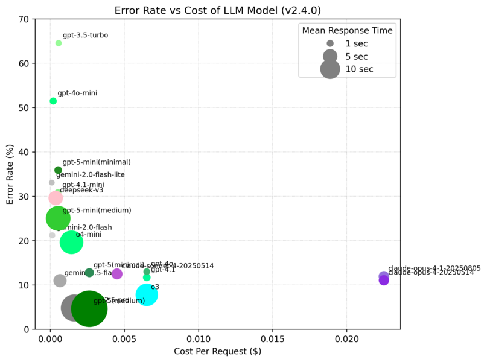
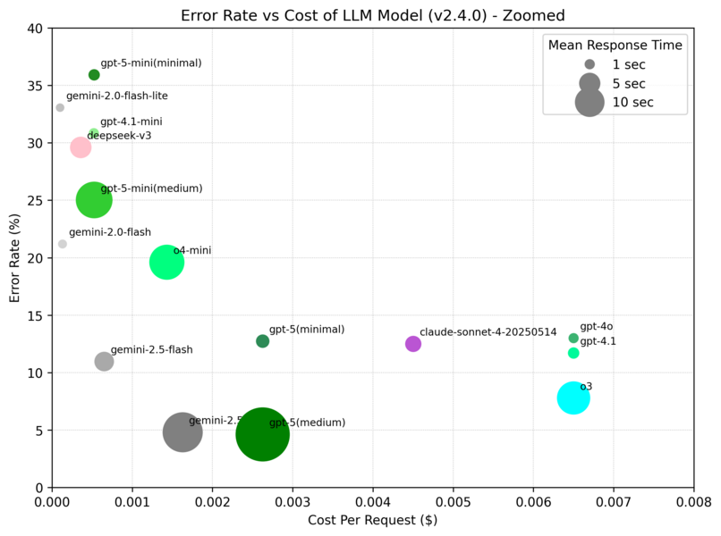
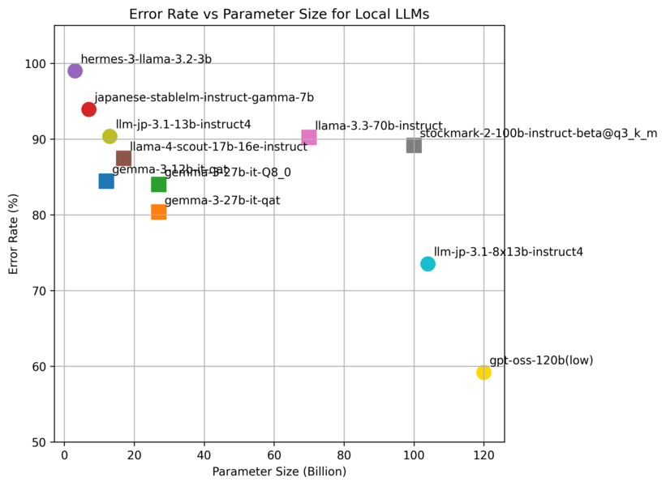

<!--
benchmark ディレクトリの README
各モデルのベンチマーク結果（平均応答時間・文字誤り率）をまとめ、傾向分析を行った内容を記載しています。
-->


# ベンチマーク結果まとめ (計測時期 2025年8月)

このディレクトリには、Sumibi クライアントを用いて取得した各モデルの応答時間および文字誤り率（CER: Character Error Rate）を集計・可視化するスクリプトと測定結果が含まれています。なお、Sumibiはローマ字かな漢字変換という性質上、応答時間が約1秒を超えるとユーザビリティが低下します。そのため、応答時間の長いモデルは実用面で不利であり、評価においても高く評価されにくい点に留意してください。

## ディレクトリ構成
- `sumibi_bench.py` / `sumibi_typical_convert_client.py`: ベンチマーク実行用スクリプト
- `aggregate_results.py`: JSON 形式の結果を統合し、CSV に出力するスクリプト
- `plot_mean_response_time.py`: 各モデルの平均応答時間を横長バー＋エラー率折れ線でプロット
- `plot_errorrate_vs_cost.py`: 文字誤り率と API コストの関係をプロット
- `plot_errorrate_vs_paramsize.py`: 文字誤り率とモデルパラメータ数の関係をプロット
- `result/`: 各モデルのベンチマーク結果 JSON ファイル

## Chat Completion API 呼び出し内容

ベンチマークでは、`sumibi_typical_convert_client.py` 内で以下の Chat Completion API 呼び出しを行っています:

```python
response = self.client.chat.completions.create(
    model=モデル名, 
    temperature=0.8,
    n=1,
    messages=messages,
)
```

### プロンプト (`messages`) の内容

| role      | content |
|-----------|---------|
| system    | あなたはローマ字とひらがなを日本語に変換するアシスタントです。ローマ字の 「nn」 は 「ん」と読んでください。\[\]\(URL\)のようなmarkdown構文は維持してください。\# や \#\# や \#\#\# や \#\#\#\# のようなmarkdown構文は維持してください。ローマ字の字面をそのままひらがなや漢字にするだけで、元のローマ字にない文章を作り出さないでください。出力は変換後の一文のみ。注釈や説明は一切付けないください。もし、入力された文章が英語の文章と判断できた場合は、日本語に翻訳してください。 |
| user      | ローマ字とひらがなの文を漢字仮名混じり文にしてください。 周辺の文章は、「こんにちは、中野です。watashi no namae ha nakano desu . どうぞよろしくお願いします。」のような文章になっています。周辺の文脈を見てそれに合った語彙を選んでください。: watashi no namae ha nakano desu . |
| assistant | 私の名前は中野です。 |
| user      | ローマ字とひらがなの文を漢字仮名混じり文にしてください。周辺の文章は、「説明はここまでです。それ以外は ikano toori desu .」のような文章になっています。周辺の文脈を見てそれに合った語彙を選んでください。: ikano toori desu . |
| assistant | 以下の通りです。 |
| user      | ローマ字とひらがなの文を漢字仮名混じり文にしてください。 周辺の文章は、「{**surrounding_text**}」のような文章になっています。 周辺の文脈を見てそれに合った語彙を選んでください。: {**text**} |

※ **surrounding_text** 部分には「近年知名度gaagattekiteori」のような変換対象の周辺文章を含む文字列が入ります。変換結果は「近年知名度が上がってきており」となります。

※ **text**部分には「gaagattekiteori」のような変換対象の文字列が入ります。


## 測定結果グラフ

注記:
  - gpt-5,gpt-5-mini,gpt-5-nanoはreasoning_effortをminimal固定です。(sumibi.elではminimalを利用)

### エラー率 vs コスト（全体表示）


### エラー率 vs コスト（ズーム表示）
低コスト・低エラー率の実用的なモデルに焦点を当てた詳細表示（エラー率0-40%、コスト0-0.008$の範囲）


### 平均応答時間とエラー率


## 傾向分析

実際にSumibiを使用した文章入力において、**レスポンスが2秒を超えると明らかにストレスが発生し実用性が低下**することが判明しました。IMEとしての実用性では応答時間が最重要要素となります。

Sumibi のユーザビリティを左右する主要因として、以下の観点を**優先度順**で評価します：
1. **レイテンシー（応答時間）**: 2秒以内が実用の必須条件
2. 文字誤り率（CER: Character Error Rate）: 実用範囲内での精度
3. API 利用コスト（$/リクエスト）: 継続利用可能なコスト

以下では実用性を重視した傾向を分析します。

### レイテンシーと精度のトレードオフでの評価
代表値（平均応答時間 / CER / コスト）を実用性重視で分類します。

- **実用的（2秒以内）**  \
  - `gemini-2.0-flash-lite`：**0.66 s / 33.1 % / $0.0000975** ─ 最速・最安だが精度は控えめ。  \
  - `gemini-2.0-flash`：**0.74 s / 21.2 % / $0.00013** ─ 速度・精度・コストのバランス最優秀。  \
  - `gpt-3.5-turbo`：0.83 s / 64.5 % / $0.00055 ─ 高速だが誤り率が高い。  \
  - `gpt-4o`：**0.98 s / 13.0 % / $0.0065** ─ 高精度だが高価。  \
  - `gpt-4.1-mini`：0.98 s / 30.8 % / $0.00052 ─ 中コスト・中精度。  \
  - `gpt-4o-mini`：1.06 s / 51.5 % / $0.000195 ─ 低価格だが精度が課題。  \
  - `gpt-5-nano`：1.14 s / 89.4 % / $0.000105 ─ 超低コストだが精度が不十分。  \
  - `gpt-4.1`：1.28 s / 11.7 % / $0.0065 ─ 高精度だが高コスト。  \
  - `gpt-5-mini`：1.28 s / 35.9 % / $0.000525 ─ 低コストで中程度精度。  \
  - `gpt-5`：1.86 s / 12.8 % / $0.002625 ─ 高精度で中程度コスト。  \

- **実用性に課題（2秒超過でストレスフル）**  \
  - `claude-sonnet-4-20250514`：2.79 s / 12.5 % / $0.0045 ─ 高精度だが遅延でストレス。  \
  - `claude-sonnet-4-5-20250929`：2.81 s / 11.6 % / $0.0045 ─ Sonnet 4より若干精度向上だが遅延は同等。  \
  - `gemini-2.5-flash`：4.20 s / 11.0 % / $0.00065 ─ 高精度だが実用には不向き。  \
  - `deepseek-v3`：5.14 s / 29.6 % / $0.000355 ─ 低コストだが遅すぎる。  \
  - `o3`：12.77 s / 7.8 % / $0.0065 ─ 最高精度だが遅延が致命的。  \
  - `o4-mini`：14.31 s / 19.6 % / $0.00143 ─ レイテンシー面で完全に不向き。  \
  - `gemini-2.5-pro`：18.83 s / 4.8 % / $0.001625 ─ **最高精度**だが日常使用不可。  \

### コスト面の評価

- **コスト最優先で実用的**  \
  - `gemini-2.0-flash-lite`：**$0.0000975** — 0.66 s / CER 33.1 %。最安値。  \
  - `gpt-5-nano`：**$0.000105** — 1.14 s / CER 89.4 %。超低コストだが精度が不十分。  \
  - `gemini-2.0-flash`：**$0.00013** — 0.74 s / CER 21.2 %。速度・精度とも実用域。  \
  - `gpt-4o-mini`：$0.000195 — 1.06 s / CER 51.5 %。低コストだが精度が課題。  \
  - `gpt-5-mini`：$0.000525 — 1.28 s / CER 35.9 %。低コストで中程度精度。  \

- **精度重視でコスパ良好**  \
  - `gpt-5`：$0.002625 — CER 12.8 %、1.86 s。高精度で中程度のコスト。  \
  - `gemini-2.5-flash`：$0.00065 — CER 11.0 ％。遅延 4.2 s を許容できれば良コスパ。  \
  - `gemini-2.5-pro`：$0.001625 — CER 4.8 %。**最高精度**で相対的に低コスト。  \
  - `claude-sonnet-4-20250514`：$0.0045 — CER 12.5 %、2.8 s。中程度のコストで良好な精度。  \
  - `claude-sonnet-4-5-20250929`：$0.0045 — CER 11.6 %、2.8 s。Sonnet 4より精度向上。  \

- **高性能だが高コスト**  \
  - `gpt-4o`：$0.0065 — CER 13 %、0.98 s。速度と精度は良好だが高コスト。  \
  - `gpt-4.1`：$0.0065 — CER 11.7 %、1.28 s。高精度だが高コスト。  \
  - `o3`：$0.0065 — CER 7.8 %、12.77 s。最高精度だが遅延大、高コスト。  \

### 総合評価

実際にSumibiを使用した文章入力において、**レスポンスが2秒を超えると明らかにストレスが発生し実用性が低下**することが判明しました。これを踏まえ、実用性を重視した評価も加味します。

**実用的なモデル（2秒以内）:**

1. **最優秀**: `gemini-2.0-flash`（0.74s / CER 21.2% / $0.00013）
   - 速度・精度・コストのバランスが最も優秀で、実用レベルの応答性を実現

2. **高精度重視**: `gpt-4o`（0.98s / CER 13.0% / $0.0065）
   - 高精度だが高コスト。精度を重視するなら選択肢

3. **バランス重視**: `gpt-5`（1.86s / CER 12.8% / $0.002625）
   - 実際の使用では**総合的なバランスが良好**。高精度（CER 12.8%）を適度なコスト（$0.002625）で実現し、1.86秒の応答時間は2秒以内でギリギリ実用範囲。日常的な文章入力において、精度・コスト・応答性の三要素が最もバランス良く調和

4. **超高速**: `gemini-2.0-flash-lite`（0.66s / CER 33.1% / $0.0000975）
   - 最速かつ最安だが精度は劣る

**実用性に課題があるモデル（2秒超過）:**

- `claude-sonnet-4-20250514`（2.79s）: 高精度だがストレスフル
- `claude-sonnet-4-5-20250929`（2.81s）: Sonnet 4より精度向上（CER 11.6%）だが遅延は同等
- `gemini-2.5-flash`（4.20s）: 高精度だが実用には不向き
- `gemini-2.5-pro`（18.83s）: 最高精度でも遅延が致命的
- `o3`（12.77s）: 高精度だが日常使用には不適

**結論**: IMEとしての実用性を考慮すると、**2秒以内の応答性**が必須条件。現実的な選択肢は1秒前後で動作するモデルに限られ、その中で `gemini-2.0-flash` が総合的に最も実用的。

## ベンチマーク環境の構築手順

1. Sumibiのリポジトリをgit cloneする

```bash
   git clone git@github.com:kiyoka/Sumibi.git
```
2. https://github.com/azooKey/AJIMEE-Bench のソースコード一式をダウンロードする

3. ./Sumibi/benchmark/AJIMEE-Benchにダウンロードしたソースコード一式を展開する

## 実行手順
1. ベンチマーク実行 ( google のgemini-2.0-flashのベンチマークデータ取得の例)
   ```bash
   export SUMIBI_AI_API_KEY="AIxxxxxxxxxxxxxxxxxxxxxxxxxxxxxxxxxxx"
   export SUMIBI_AI_BASEURL=https://generativelanguage.googleapis.com/v1beta/openai/
   export SUMIBI_AI_MODEL=gemini-2.5-flash-preview-04-17   
   make result/gemini-2.0-flash.json
   ```  

2. 結果集計
   ```bash
   make aggregate 
   ```  
   
3. プロット生成
   ```bash
   make plots
   ```

# 入力形式による精度の違い（GitHub Issue 96の成果）

ここまでの計測結果は、全てローマ字をLLMに入力した計測結果です。

このパートでは、異なる入力形式（ローマ字、ひらがな、カタカナ）がLLMの変換精度に与える影響を調査しました。
その結果、**ローカルLLMだけでなく、各種フロンティアモデルにおいても、ひらがな入力に変更することで劇的に変換精度が改善する**ことが実証されました。

## フロンティアモデルにおける改善効果

最新のフロンティアモデルでも、ひらがな入力による明確な精度向上が確認されています：

| モデル | ローマ字入力 | カタカナ入力 | ひらがな入力 | 改善率 (H/R) |
|--------|-------------|-------------|-------------|--------------|
| gemini-2.5-pro | 5.9% | 4.0% | **2.2%** | **63%削減** |
| gpt-4.1 | 11.7% | 9.0% | **5.0%** | **57%削減** |
| gpt-5 | 13.1% | 9.8% | **5.2%** | **60%削減** |
| gemini-2.5-flash | 11.0% | 10.4% | **5.5%** | **50%削減** |
| gpt-4o | 13.0% | 9.3% | **6.6%** | **49%削減** |
| gemini-2.0-flash | 21.2% | 17.8% | **9.1%** | **57%削減** |
| gpt-4.1-mini | 30.8% | 20.1% | **14.6%** | **53%削減** |
| gemini-2.0-flash-lite | 33.1% | 23.0% | **15.0%** | **55%削減** |
| gpt-5-mini | 34.4% | 23.5% | **15.4%** | **55%削減** |

## ローカルLLMにおける劇的な改善

ローカルLLMでは、さらに顕著な改善効果が見られます：

| モデル | ローマ字入力 | カタカナ入力 | ひらがな入力 | 改善率 (H/R) |
|--------|-------------|-------------|-------------|--------------|
| gemma-3n-e4b-it-mlx | 68.3% | 47.9% | **37.0%** | **46%削減** |
| gemma-3-12b-it-qat | 73.0% | 58.4% | **42.9%** | **41%削減** |
| gpt-3.5-turbo | 64.5% | 61.8% | **47.8%** | **26%削減** |
| llm-jp-3.1-13b-instruct4 | 91.5% | 67.5% | **53.2%** | **42%削減** |
| gpt-5-nano | 88.0% | 69.9% | **57.3%** | **35%削減** |

## 主要な知見

1. **すべてのモデルでひらがな入力が最高精度**: 調査した19モデルすべてで、ひらがな入力が最も低いエラー率を記録
2. **フロンティアモデルでも49-63%の改善**: 最新のGPTやGeminiモデルでも、ひらがな入力により大幅な精度向上
3. **gemini-2.5-proが最高精度**: ひらがな入力で2.2%の最低エラー率を達成
4. **カタカナ入力はモデルによって異なる**: モデルによって、ローマ字入力と同等〜中間的な精度
5. **日本語文脈の理解が鍵**: LLMは日本語文字列（ひらがな）を入力することで、文脈をより正確に理解できる


## 実装詳細

入力モードは `sumibi_bench.py` の第3引数で指定します：

```bash
# ひらがな入力モード（推奨）
python3 sumibi_bench.py evaluation_items.json output_hiragana.json hiragana_input

# カタカナ入力モード
python3 sumibi_bench.py evaluation_items.json output_katakana.json katakana_input

# ローマ字入力モード（デフォルト）
python3 sumibi_bench.py evaluation_items.json output_romaji.json romaji_direct_input
```

または、Makefileを使用：

```bash
# ひらがな入力モード
make result_ver2.4.0/gpt-4.1_hiragana.json

# カタカナ入力モード
make result_ver2.4.0/gpt-4.1_katakana.json
```

# ローカルLLM

このパートでは、ローカルLLMの実現性について調べるため、ベンチマークを取得した結果を記載します。

ローカルLLMでもベンチマークデータを取得しました。120B(1200億パラメータ)までのモデルを試し、当初はローマ字入力（従来方式）では実用的に使えるモデルがありませんでした。しかし、**GitHub Issue 96の実験により、ひらがな入力を使用することで劇的にエラー率が改善することが判明しました**。

## 入力形式による精度の違い（GitHub Issue 96の成果）

3つの入力形式（romaji_direct_input、hiragana_input、katakana_input）で比較実験を実施した結果：

- **hiragana_input（ひらがな入力）**: **全モデルでローマ字入力に対して29-42%のエラー率削減を達成**
  - gemma-3-12b-it-qat: CER 73.04% → **42.85%**（-41.3%改善）
  - llm-jp-3.1-13b-instruct4: CER 91.49% → **53.19%**（-41.9%改善）
  - openai/gpt-oss-20b: CER 82.30% → **51.17%**（-37.8%改善）
  - sarashina2.2-3b-instruct-v0.1: CER 86.91% → **61.47%**（-29.3%改善）

- **katakana_input（カタカナ入力）**: ローマ字入力より改善するが、ひらがな入力ほどではない
  - 一部モデル（gpt-oss-20b、sarashina2.2等）ではカタカナ入力により一定の改善が見られる
  - しかし、ひらがな入力と比較すると改善効果は限定的
  - カタカナが日本語文字であることで多少の精度向上はあるものの、ひらがなによる文脈理解の向上が最も大きな精度改善の要因であることが明確

この結果から、**ひらがな入力を使用することでLocal LLMでも実用レベルに近づく可能性**があることが実証されました。LLMは日本語の文字で入力されることで、文脈をより正確に理解し、適切な漢字変換を行えることが明らかになりました。

## 大規模モデルの結果

新たにテストした`gpt-oss-120b(low)`（Amazon Bedrock経由）でも、ローマ字入力ではCER 59.2%、応答時間 5.25秒という結果で、従来の100Bパラメータ以下のモデルと同様に実用性の課題がありました。120Bまでパラメータ数を拡張しても、ローマ字入力では変換精度向上はほとんど見られませんでした。

## 結論

- **ひらがな入力により、Local LLMの変換精度は劇的に向上**し、小型・中型モデルでも実用レベルに近づく可能性がある
- **従来方式（ローマ字入力）では、120Bパラメータまでのモデルでも実用的な精度には到達しない**
- 一般的なPCやクラウドのGPUサーバーで稼働できるモデルには予算面での限界があるため、現時点では**Sumibiは各種ビッグテックのAPI経由で利用することが最も現実的**
- ただし、今後ひらがな入力対応を前提としたLocal LLM利用も選択肢として検討の余地がある
- モデルのパラメータ数が少なくても日本語の性能が良いモデルが登場した場合、ひらがな入力での追試を実施予定

  - `(low)`というサフィックスが付いているモデルは、reasoning_effortをlow指定したケースを指します。

### エラー率 vs パラメーターサイズ（全体表示）



### エラー率 vs パラメーターサイズ（ズーム表示）

0-25Bパラメータの小型・中型モデルの詳細比較（エラー率: 35-110%）

このグラフから、**ひらがな入力（赤色）にすることで、ローマ字入力（青色）と比較して劇的にエラー率が減少する**ことが明確に読み取れます。灰色の点線は同じモデルの異なる入力形式を結んでおり、すべてのモデルで一貫してひらがな入力による大幅な精度向上（29-42%のエラー率削減）が確認できます。カタカナ入力（緑色）はローマ字入力より改善する傾向が見られますが、ひらがな入力ほどの劇的な改善効果はありません。この結果から、**ひらがなによる文脈理解の向上が精度改善の最も重要な要因**であることが実証されています。


# ローカルLLMの実行環境

- GPU-16GByte RAMに収まる場合、基本的にはMacbook Air M4 24MByte memory 使用
- GPU-16GByte RAMに収まる場合の別の選択肢として、 AWS g6.xlarge 使用 ( USD 1.3512:Windows/Tokyo region)
- GPU 48GByte RAMに拡張したい場合、AWS g6e.2xlarge 使用 ( USD 3.61968:Windows/Tokyo region)

### 利用するEC2インスタンスタイプ

| インスタンス名     | vCPU | メモリ (GiB) | NVIDIA L4 Tensor Core GPU | GPU メモリ (GiB) | ネットワーク帯域幅 (Gbps) | EBS 帯域幅 (Gbps) |
|-------------------|------|--------------|--------------------------|------------------|--------------------------|-------------------|
| **g6.xlarge**     | 4    | 16           | 1                        | 24               | 最大 10                  | 最大 5            |
| g6.2xlarge        | 8    | 32           | 1                        | 24               | 最大 10                  | 最大 5            |
| g6.4xlarge        | 16   | 64           | 1                        | 24               | 最大 25                  | 8                 |

| インスタンス名      | vCPU | メモリ (GiB) | NVIDIA L40S GPU | GPU メモリ (GB) | ネットワーク帯域幅 (Gbps) | EBS 帯域幅 (Gbps) |
|------------------|------|--------------|------------------|------------------|---------------------------|-------------------|
| g6e.xlarge       | 4    | 32           | 1                | 48               | 最大 20                   | 最大 5            |
| **g6e.2xlarge**  | 8    | 64           | 1                | 48               | 最大 20                   | 最大 5            |
| g6e.4xlarge      | 16   | 128          | 1                | 48               | 20                        | 8                 |

## 開発環境のセットアップ

### venv環境の作成と有効化

```bash
# venv環境の作成
python3 -m venv venv

# venv環境の有効化
source venv/bin/activate

# OpenAIライブラリの最新版をインストール
pip install --upgrade openai

# venv環境の無効化（作業完了後）
deactivate
```

### 環境変数の設定

```bash
export SUMIBI_AI_API_KEY="your-api-key"
export SUMIBI_AI_MODEL="gpt-4.1-mini"
```

