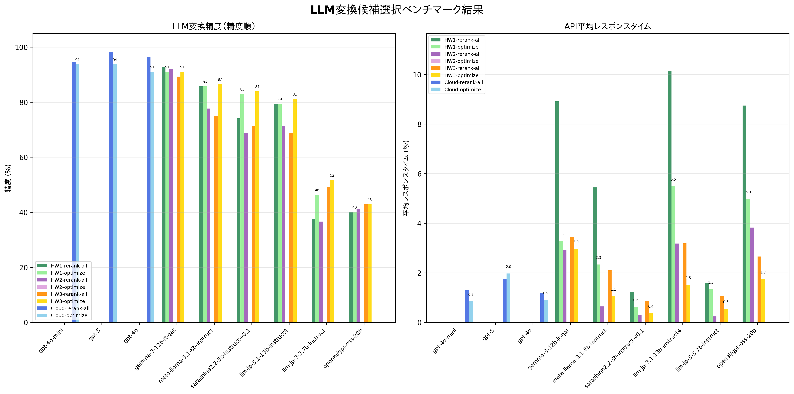

# Mozc Conversion Helper Benchmark

## 概要

このディレクトリは、issue #87 で提案された「LLMを使った Mozc 変換候補の知的選択」のベンチマーク環境です。
現代日本語への適合性を高めるため、Livedoorニュース・コーパスを使用しています。

## 目的

バックエンドが mozc モードの際に、LLM が文脈に最適な変換候補を自動選択をどのように改善できるかを検証します。

## 結果



### 計測に使用したハードウェア

すべてのハードウェアでLM Studioを使用した。スペックは以下の通り。

| 項目 | hardware1 | hardware2 | hardware3 |
|------|-----------|-----------|-----------|
| CPU | 11th Gen Intel Core i5-11400F @ 2.60GHz | AMD Ryzen 7 5700X 8-Core Processor | Apple M4 |
| Architecture | x86_64 | x86_64 | ARM64 |
| RAM | 15.9 GB | 31.9 GB | 24.0 GB |
| GPU | NVIDIA GeForce GTX 1650 | NVIDIA GeForce RTX 4060 Ti | Apple Silicon |
| VRAM | 4.0 GB | 8.0 GB | 16.0 GB |
| Compute Capability | 7.5 (CUDA) | 8.9 (CUDA) | Metal |

### ベンチマーク結果サマリー(hardware1のデータのみ掲載しています)

| モデル | LLM精度 | 平均レスポンス時間 |
|-------|---------|-------------------|
| gpt-5 | 98.2% | 1.764s |
| gpt-4o | 96.4% | 1.177s |
| gpt-4o-mini | 94.6% | 1.292s |
| gemma-3-12b-it-qat | 92.9% | 8.916s |
| meta-llama-3.1-8b-instruct | 85.7% | 5.442s |
| llm-jp-3.1-13b-instruct4 | 79.5% | 10.137s |
| sarashina2.2-3b-instruct-v0.1 | 74.1% | 1.226s |
| openai/gpt-oss-20b | 40.2% | 8.746s |
| llm-jp-3-3.7b-instruct | 37.5% | 1.590s |

### Hardware1 vs Hardware2 レスポンス時間比較

| モデル | Hardware1<br>レスポンス時間 | Hardware2<br>レスポンス時間 | 高速化率 |
|-------|--------------------------|--------------------------|---------|
| gemma-3-12b-it-qat | 8.916s | 2.922s | 3.05x |
| llm-jp-3-3.7b-instruct | 1.590s | 0.240s | 6.61x |
| llm-jp-3.1-13b-instruct4 | 10.137s | 3.178s | 3.19x |
| meta-llama-3.1-8b-instruct | 5.442s | 0.640s | 8.50x |
| openai/gpt-oss-20b | 8.746s | 3.824s | 2.29x |
| sarashina2.2-3b-instruct-v0.1 | 1.226s | 0.283s | 4.33x |

Hardware2では、全モデルで大幅なレスポンス時間の改善が見られました。特に**meta-llama-3.1-8b-instruct**は約8.5倍、**llm-jp-3-3.7b-instruct**は約6.6倍の高速化を実現しています。

### ローカルLLMの評価と推奨モデル

**総合評価（レスポンス時間重視）:**

1. **最適ローカルLLM: sarashina2.2-3b-instruct-v0.1**
   - 精度: 74.1%（実用レベル）
   - 応答時間: 1.226s（高速・実用的）
   - **リアルタイム入力に適した高速応答**

2. **バランス重視: meta-llama-3.1-8b-instruct**
   - 精度: 85.7%（ローカルLLM中最高）
   - 応答時間: 5.442s（やや遅い）
   - 精度を優先し、待機時間を許容できる場合

3. **サブ選択肢: gemma-3-12b-it-qat**
   - 精度: 92.9%（高精度）
   - 応答時間: 8.916s（遅い）
   - 精度を最重視する場合のみ検討可能

**推奨しないモデル:**
- `llm-jp-3.1-13b-instruct4`: 応答時間10.137sは実用的でない
- `openai/gpt-oss-20b`: 精度40.2%と応答時間8.746sの両方が劣悪
- `llm-jp-3-3.7b-instruct`: 精度37.5%と極めて低い

**結論:**
レスポンス時間を重視する場合、ローカルLLMでSumibiの変換候補選択に最も適しているのは **sarashina2.2-3b-instruct-v0.1** です。
1.226sの応答速度により、リアルタイムな日本語入力でストレスを感じることなく使用できます。

## ベンチマーク作成手順（Livedoor ニュース）

1. 事前準備: Livedoor ニュースコーパス（LDCC）を入手・展開
   - 例: `./external/LDCC/text/...` にカテゴリ別の `.txt` が並ぶ状態
2. プレーンテキスト化: 記事を1行テキストに整形
   - `python3 scripts/prepare_livedoor.py ./external/LDCC/text`
   - 出力: `data/corpus/livedoor.txt`
3. パターン抽出: `python3 scripts/extract_patterns_from_corpus.py`
   - `data/corpus/*.txt` を自動検出し、`extracted_pattern_code.txt` を生成
4. 正解データ作成: `python3 scripts/create_ground_truth_data.py`
   - `ground_truth_data.json` を生成
5. テストケース検証: `python3 scripts/test_embedded_cases.py`
6. ベンチマーク実行: `export OPENAI_API_KEY=... && make run-benchmark`

## ディレクトリ構成

- `data/` - Livedoor 抽出済みプレーンテキスト（`data/corpus/livedoor.txt` など）
- `scripts/` - データ処理・ベンチマーク実行スクリプト
- `results/` - ベンチマーク結果
- `mozc_helper/` - Mozc 変換候補シミュレーションモジュール

## ベンチマーク実行手順

**注意:** ベンチマークを実行する前に、必ず`../benchmark/venv`の仮想環境を有効化してください。
詳細は「[環境要件](#環境要件)」セクションを参照してください。

### 1. 基本的な実行

```bash
# 仮想環境を有効化
source ../benchmark/venv/bin/activate

# OpenAI APIキーを設定
export OPENAI_API_KEY="your-api-key"

# デフォルト（gpt-5）でベンチマーク実行
make run-benchmark
```

### 2. モデルの切り替え

```bash
# gpt-4o-miniを使用
export OPENAI_MODEL="gpt-4o-mini"
make run-benchmark

# gpt-4を使用
export OPENAI_MODEL="gpt-4"
make run-benchmark

# ローカルLLM（LM Studio等）を使用
export OPENAI_API_KEY="dummy"
export OPENAI_BASEURL="http://192.168.56.1:1234/"
export OPENAI_MODEL="openai/gpt-oss-20b"
make run-benchmark
```

### 3. 結果の確認とグラフ化

```bash
# ベンチマーク結果をグラフで表示
make plot-results

# 個別の結果ファイルを確認
ls results/
# gpt-5.json, openai--gpt-oss-20b.json など
```
### 4. 結果ファイル

- `results/{model}.json`: 各モデルの詳細結果
- `benchmark_comparison.png`: モデル比較グラフ

## 環境要件

- Python 3.8+
- OpenAI API（LLM 用）
- Livedoorニュース・コーパス

### Python仮想環境の設定

このベンチマークを実行する際は、`../benchmark/venv`配下の仮想環境を使用する必要があります。
この仮想環境には、必要なOpenAIライブラリ（バージョン1.50.0以降推奨）が含まれています。

```bash
# 仮想環境を有効化（Linux/macOS）
source ../benchmark/venv/bin/activate

# 仮想環境を有効化（Windows）
..\benchmark\venv\Scripts\activate

# 仮想環境が有効化されているか確認
which python3  # または where python3 (Windows)
python3 --version
python3 -c "import openai; print(f'openai version: {openai.__version__}')"

# ベンチマーク実行
make run-benchmark

# 作業完了後、仮想環境を無効化
deactivate
```

**重要:** OpenAI 1.50.0以降を使用すると、gpt-5の`reasoning_effort`パラメータがサポートされます。
古いバージョン（1.12.0など）でも動作しますが、警告が表示されます。

## 注意点
- 旧仮名/旧字体など歴史的表記に引きずられないよう、現代表記を使うコーパス(Livedoorニュース)を使っています。

## プロンプト最適化モード（optimize）

### 概要

通常のrerank-allモード（全候補並び替え）に加えて、レスポンス時間を重視した**optimizeモード**を実装しています。

### 2つのプロンプトモード比較

| モード | 説明 | 文脈 | 出力 | 用途 |
|--------|------|------|------|------|
| **rerank-all** | 全候補を並び替え | 全文脈 | 全候補をランク順に出力 | 精度重視 |
| **optimize** | 最適な1つだけ選択 | 前方10文字のみ | 最適な候補1つのみ | 速度重視 |

### optimizeモードの最適化内容


#### 1. **文脈の短縮**
- **変更前**: 全文脈を送信
  ```
  文脈: まず特徴としては外見磨きや一般的なマナーの向上に力を入れていることが[wakaru]
  ```
- **変更後**: 変換対象の前方10文字のみ
  ```
  文脈: 入れていることが[wakaru]
  ```

#### 2. **出力の簡略化**
- **変更前**: 全候補を並び替えて出力（例: 6候補 × 平均3トークン = 約18トークン）
- **変更後**: 最適な1つだけ出力（例: 1候補 × 3トークン = 約3トークン）

#### 3. **max_tokensの削減**
- **OpenAI API**
  - rerank-all: 20トークン
  - optimize: 10トークン
- **ローカルLLM**
  - rerank-all: 50トークン
  - optimize: 20トークン

### 使用方法

```bash
# optimizeモードでベンチマーク実行
export OPENAI_API_KEY="your-api-key"
export OPENAI_MODEL="gpt-4o-mini"
make run-benchmark-optimize

# hardware1でoptimizeモード実行
make run-benchmark-hw1-optimize

# hardware2でoptimizeモード実行
make run-benchmark-hw2-optimize

# hardware3でoptimizeモード実行 (MacBook Air)
make run-benchmark-hw3-optimize
```

### 期待される効果

1. **入力トークン削減**: 50-100トークン → 15-20トークン（約70-80%削減）
2. **出力トークン削減**: 18トークン → 3トークン（約80%削減）
3. **レスポンス時間改善**: 10-30%程度の高速化が期待される
4. **API料金削減**: 入出力トークン数に比例して削減

### 精度への影響

文脈を短縮することで、精度が若干低下する可能性があります。ベンチマーク結果を確認して、用途に応じてrerank-allとoptimizeを使い分けてください。

### 結果ファイル

optimizeモードで実行した結果は、ファイル名に`-optimize`サフィックスが付きます：
- `results/gpt-4o-mini-optimize.json`
- `results/hardware1/meta-llama-3.1-8b-instruct-optimize.json`
- `results/hardware3/meta-llama-3.1-8b-instruct-optimize.json`

グラフでは、同じモデルのrerank-allとoptimizeが隣り合って表示され、ハードウェア別に色分けされます：
- **Hardware1**: 緑系（rerank-all=濃い緑、optimize=明るい緑）
- **Hardware2**: 紫系（rerank-all=濃い紫、optimize=明るい紫）
- **Hardware3**: オレンジ系（rerank-all=濃いオレンジ、optimize=明るいオレンジ）
- **Cloud**: 青系（rerank-all=濃い青、optimize=明るい青）
